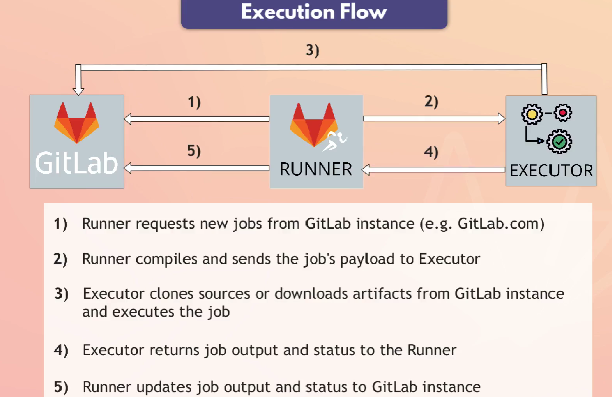

- artifact is used for versioning as it will store the file from dev server and make available to further stages(build,prod)

- what to do in same stage? as test and build in same then how will it download artifacts, use dependencies in such case

